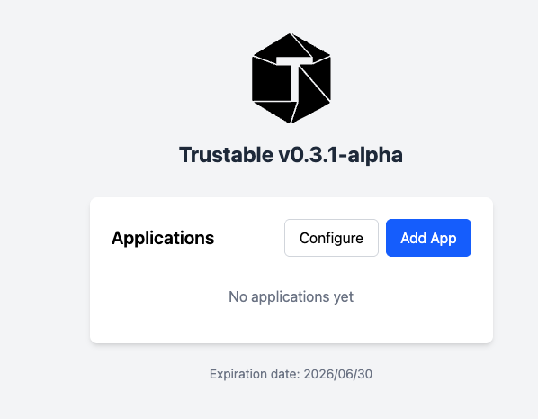
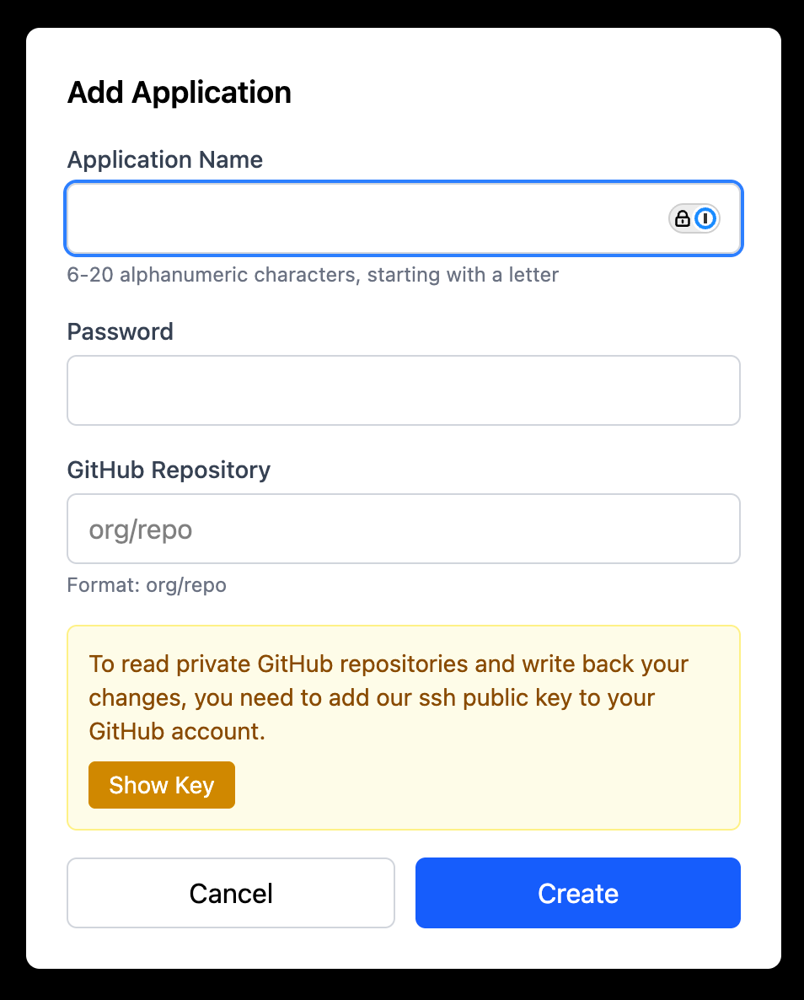
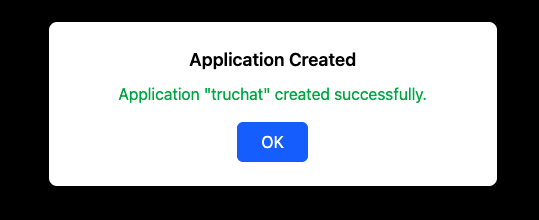
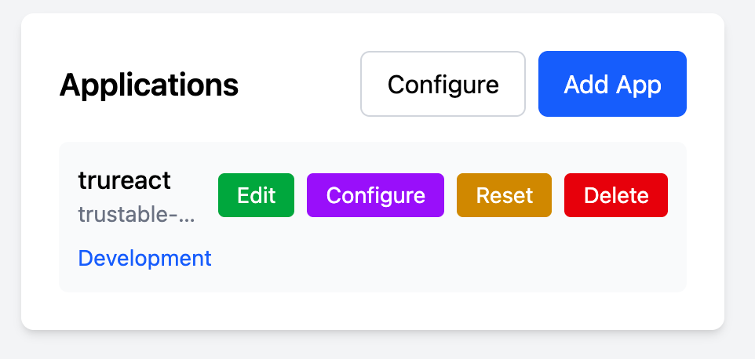

generate 2-create.py script with uv using playwright

# start
connect to localhost:8910 follow the redirect

click on the continue button after configuration

check there is the "Add App" button: 

# application

Click on Add App: 

Fill the form

Application name: trureact
Password: trureact
GitHub Repo:  trustable-ai/tru-react

Wait until the Continue button appears, then click

Check there is the application "trureact" in the list 

# capture exit

add an handler that captures exiting
and keep the browser visibile asking to press a key before actually exiting
